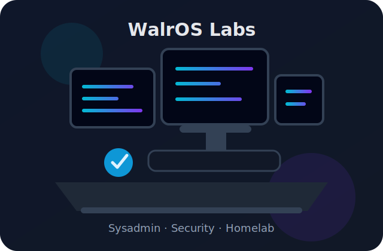
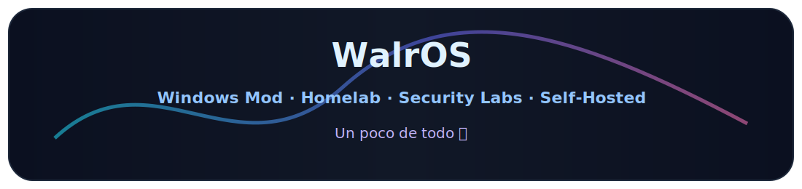

<div align="center">


# Hola, soy Álex 👋

### Sysadmin · Cybersecurity · Pentesting · Linux · Networking · Homelab Builder · Security Labs

<br>


<br><br>


</div>

---

## 🧑‍💻 Sobre mí

Soy **Técnico de Sistemas Informáticos en Red**, especializado en administración de sistemas, virtualización, redes, automatización y ciberseguridad.

No me limito a estudiar teoría: monto laboratorios, pruebo infraestructura, automatizo procesos, despliego servicios self-hosted y desarrollo proyectos propios bajo la marca **WalrOS**.

- 🎓 **ASIR**
- 🖥️ Experiencia práctica con **Windows Server, Ubuntu Server y entornos Linux/Windows**
- 🐳 Administración de servicios con **Docker** y entornos self-hosted
- 🧪 Laboratorios con **VMware, VirtualBox, Active Directory, redes y Kali Linux**
- 🔐 Enfoque en **ciberseguridad, hardening, privacidad y análisis defensivo**
- ⚙️ Automatización con **PowerShell, Bash y Python**
- 🤖 Experimentación con **IA local usando Ollama y Llama3**
- 🦭 Creador de **WalrOS**, un Windows modificado enfocado en rendimiento, privacidad y experiencia de usuario
- 🌐 Construyendo el ecosistema WalrOS con **walros.org**, **forum.walros.org** y proyectos propios

<br>

<div align="center">
  
</div>

<br>

---

## 💻 Proyectos principales

<table>
<tr>
<td width="50%" valign="top">

### ⚙️ WalrOS

Proyecto principal: un **Windows modificado** orientado a rendimiento, privacidad, optimización gaming y eliminación de bloatware.

WalrOS no es solo una modificación del sistema; es la base de una marca técnica donde desarrollo herramientas, servicios, comunidad y proyectos propios.

**Enfoque:**


- Optimización avanzada del sistema
- Reducción de servicios innecesarios
- Eliminación de bloatware
- Ajustes de privacidad y telemetría
- Mejoras de rendimiento y experiencia de usuario
- Identidad visual y ecosistema propio

</td>
<td width="50%" valign="top">

### 🪙 Polymarket Bot

Bot de trading para Polymarket con arquitectura **safety-first**, modo paper, dashboard, controles de riesgo y protección contra live trading accidental.

**Stack:**


- Backend con FastAPI
- Dashboard con React/Vite
- Paper trading por defecto
- LiveTradingGuard para evitar operaciones reales accidentales
- RiskManager con límites y filtros
- Autenticación y endpoints protegidos
- Tests automatizados

</td>
</tr>

<tr>
<td width="50%" valign="top">

### 🏠 Servidor NAS Self-Hosted

Infraestructura NAS/self-hosted basada en Docker y CasaOS para administrar servicios privados, almacenamiento y automatizaciones.

**Stack:**


- Administración de servicios autoalojados
- Gestión de contenedores Docker
- Organización de almacenamiento
- Infraestructura casera privada
- Base para pruebas, servicios y automatizaciones

</td>
<td width="50%" valign="top">

### 🎬 Automatización Multimedia

Sistema de automatización orientado a contenido multimedia con Plex, Zurg y Real-Debrid.

**Enfoque:**


- Automatización de procesos multimedia
- Integración con servicios self-hosted
- Organización de flujos y tareas
- Mantenimiento de servicios privados
- Enfoque en eficiencia y control local

</td>
</tr>

<tr>
<td width="50%" valign="top">

### 🤖 IA Local con Ollama

Entorno local para ejecutar modelos de IA, experimentar con automatización y mantener mayor control sobre privacidad y recursos.

**Stack:**


- Ejecución local de modelos
- Pruebas con Llama3
- Automatización asistida por IA
- Entorno privado de experimentación
- Integración con herramientas propias

</td>
<td width="50%" valign="top">

### 🧪 Laboratorios Virtualizados

Entornos virtualizados para practicar administración de sistemas, redes, Active Directory, Linux/Windows y seguridad.

**Stack:**


- Laboratorios Windows/Linux
- Active Directory
- Redes y segmentación
- Pruebas con Kali Linux
- Administración de servicios
- Seguridad en entornos controlados

</td>
</tr>

<tr>
<td width="50%" valign="top">

### 🌐 Ecosistema WalrOS

WalrOS está creciendo como marca técnica para agrupar mis proyectos, servicios, herramientas y comunidad.

**Enlaces:**

[](https://www.walros.org)
[](https://forum.walros.org)

- Web principal
- Foro propio
- Proyectos bajo identidad WalrOS
- Servicios técnicos
- Comunidad y documentación
- Marca personal orientada a sistemas y ciberseguridad

</td>
<td width="50%" valign="top">

### 🔐 Security Research Labs

Laboratorios de seguridad para practicar análisis, hardening, redes, comportamiento de sistemas y defensa en entornos aislados.

**Áreas:**


- Pentesting en laboratorio
- Hardening básico
- Análisis defensivo
- Redes y servicios
- Pruebas en máquinas aisladas
- Aprender rompiendo sin tocar producción

</td>
</tr>
</table>

---

## 🛠️ Stack / Herramientas

<div align="center">

### Sistemas e infraestructura


<br><br>


<br><br>

### Desarrollo y automatización


<br><br>


<br><br>

### Virtualización, redes y seguridad


<br><br>

### IA local


</div>

<br><br>

---

## 🎯 ¿Qué quiero alcanzar?

```txt
> Consolidar WalrOS como Windows mod y como marca de proyectos técnicos
> Mejorar mi infraestructura self-hosted y mis servicios propios
> Profundizar en Windows Server, Linux, redes y Active Directory
> Montar laboratorios de ciberseguridad cada vez más completos
> Automatizar tareas con PowerShell, Bash, Python y Docker
> Experimentar con IA local usando Ollama, Llama3 y herramientas privadas
> Construir proyectos reales que demuestren capacidad técnica, no solo teoría
```
---

## 💬 Frases que pienso que me representan

<div align="center">

> “Si algo está expuesto, más te vale saber cómo está protegido ;)”

<br>

> “Menos humo, más labs, más infraestructura y más proyectos reales.”

<br>

> “Romper, entender, arreglar y mejorar.”

</div>

---

## 🌐 Contacto

<div align="center">

[](https://github.com/walrosproject)[](https://www.walros.org)
[](https://www.linkedin.com/in/alexandercalle/)

</div>

---

<div align="center">



<br><br>


</div>
